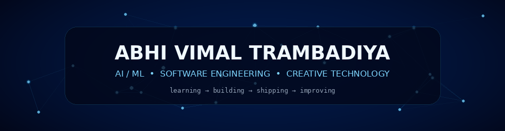

 

 

 

## `01.` About Me

I'm an **AI & Machine Learning student and software developer** interested in building practical products where intelligent systems meet strong engineering. I enjoy working across the full journey — from **ML models and backend APIs to databases, cloud deployment and user experience**.

- 🤖 Exploring **Machine Learning, Agentic AI & MLOps**
- ☁️ Interested in **backend engineering, AWS, cloud architecture & system design**
- 🧪 Learning through **projects, open source, hackathons and research-oriented work**
- 🎬 Also into **video editing & visual storytelling** with DaVinci Resolve and Final Cut Pro
- ⚡ I like combining **AI + Engineering + Creativity**

 

  

---

## `02.` Toolbox

### AI / ML

### Languages

### Web / Backend

### Data / Cloud / Tools

### Creative

---

## `03.` Selected Work

<table>
<tr>
<td width="33%" valign="top">

### ☁️ Cloud Platform
**Production-style application architecture**

`AWS` `ECS` `ECR` `ALB` `RDS` `S3`

Containerized frontend/backend, load-balanced services, relational storage, object storage and isolated code execution.

</td>
<td width="33%" valign="top">

### 🎓 Alumni Platform
**Full-stack community platform**

`React` `Node.js` `Express` `MongoDB`

Authentication, alumni profiles, events, networking and dedicated administrative flows.

</td>
<td width="33%" valign="top">

### 🎨 Artist Portfolio
**Design-focused web experience**

`React` `Tailwind CSS` `Web3Forms`

Responsive components, contact workflows and a strong focus on visual hierarchy and usability.

</td>
</tr>
</table>

> **I’m most interested in AI projects where the model is only one part of a complete, reliable system.**

---

## `04.` Highlights

| | |
|---|---|
| 🥇 **PBL 2025** | Department Winner |
| 🚀 **Smart India Hackathon 2024** | Finalist |
| 🎓 **B.Tech CSE** | Artificial Intelligence & Machine Learning |
| 🌱 **Focus** | AI Systems • Cloud • Backend • Open Source |
| 🎬 **Creative Side** | Editing • Storytelling • Visual Communication |

---

## `05.` GitHub Intelligence

<picture>
  <source media="(prefers-color-scheme: dark)" srcset="./assets/profile-cards/overview.dark.svg" />
  
</picture>

  

<picture>
  <source media="(prefers-color-scheme: dark)" srcset="./assets/profile-cards/lifetime.dark.svg" />
  
</picture>

---

## `06.` Contribution Activity

<picture>
  <source media="(prefers-color-scheme: dark)" srcset="./assets/profile-cards/contributions.dark.svg" />
  
</picture>

  

<picture>
  <source media="(prefers-color-scheme: dark)" srcset="./assets/profile-cards/rhythm.dark.svg" />
  
</picture>

 

### 🐍 Contribution Flow

Generated automatically from my GitHub contribution graph.

---

## `07.` Beyond Code

I enjoy **video editing, visual storytelling and design** alongside engineering. That creative background influences how I think about products: not only whether something works, but whether it is clear, thoughtful and enjoyable to use.

---

### Build with curiosity. Engineer with intent. Create with character.

 

  

